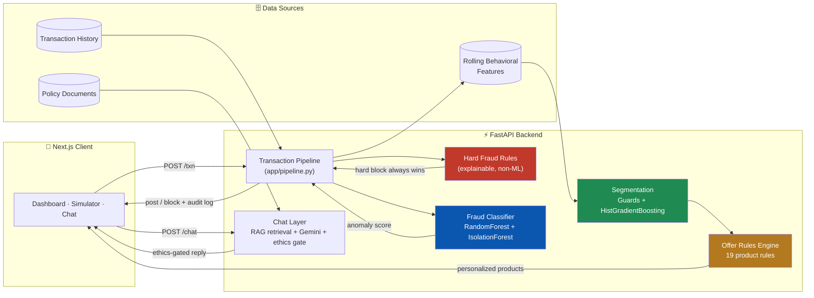

<div align="center">

# 🏦 MISP

### AI-Powered Hyper-Personalized Banking for Bharat

**A digital bank that reads a customer's real financial life — not a generic dashboard — and turns it into personalized products, plain-language explanations in the user's own language, and protection that steps in *before* a crisis, not after.**

*Built for the theme: **Digital Transformation in Lending***

[](backend/requirements.txt)
[](backend/requirements.txt)
[](frontend/package.json)
[](frontend/package.json)
[](backend/requirements.txt)
[](backend/app/db.py)
[](LICENSE)

**[▶ Live App](https://hack-out-26.vercel.app)** &nbsp;·&nbsp; **[⚙ Live API](https://hackout-26.orangeriver-ab0e0303.centralindia.azurecontainerapps.io/health)** &nbsp;·&nbsp; **[🧠 Model Docs](backend/ML_MODEL_README.md)**

</div>

---

## 30-second pitch

Indian banks now have UPI, video KYC, and mobile apps — but the *experience* behind them is still one-size-fits-all. A salaried first-jobber, a stressed borrower who just missed an EMI, and someone saving for a wedding all see the **same generic pop-ups**, in the **same language**, with **no explanation** of why a payment got blocked or a loan got refused.

**MISP is a working prototype of the alternative**: every transaction runs through a real decision pipeline — hard fraud rules, a trained fraud classifier, and a behavioral-segmentation model — that decides in milliseconds whether to *post it, protect it, or personalize around it*, and can always explain exactly why, in the customer's own language, to a regulator or the customer themselves.

| Hackathon ask | What we built |
|---|---|
| **1. Personalized product recommendations** from transaction history & life-stage signals | 19-rule recommendation engine driven by 7 behavioral segments + live spend/savings/EMI features — see [§ Personalization Engine](#-2-personalization-engine) |
| **2. Simplified, vernacular digital journeys** (onboarding, KYC, loans) | Mock DigiLocker KYC in one tap + a trilingual (EN/HI/GU) conversational assistant — see [§ Vernacular Assistant](#-3-vernacular-conversational-assistant) |
| **3. Early fraud/stress detection with empathetic intervention**, not punitive flags | Hard rules + ML fraud score + a **Grace Period**, not a loan freeze, the moment stress is detected — see [§ Fraud & Stress Engine](#-1-fraud--stress-detection-engine) |

---

## Table of contents

- [Problem statement](#-the-problem-statement-we-answered)
- [Architecture](#-architecture)
- [The three pillars](#-the-three-pillars)
  - [1. Fraud & stress detection engine](#-1-fraud--stress-detection-engine)
  - [2. Personalization engine](#-2-personalization-engine)
  - [3. Vernacular conversational assistant](#-3-vernacular-conversational-assistant)
- [Explainability & audit trail](#-explainability--audit-trail)
- [Ethical safeguards](#-ethical-safeguards)
- [Tech stack](#-tech-stack)
- [Repository structure](#-repository-structure)
- [API reference](#-api-reference)
- [Getting started](#-getting-started)
- [Demo personas](#-demo-personas)
- [Honest limitations](#-honest-limitations--whats-mocked)
- [Roadmap](#-roadmap)
- [License](#-license)

---

## 📋 The problem statement we answered

> **Theme:** Digital Transformation in Lending — *AI-Powered Hyper-Personalized Banking for Bharat*
>
> Indian banks have rich transactional and behavioral data, yet treat every customer the same way — generic offers, drop-off-heavy digital journeys, and punitive fraud flags instead of proactive, empathetic support.

We treated this as a systems-design problem, not a slide deck: **every decision below is a real, running code path** — a hard-rule engine, two trained ML models, a rules-based offer engine, and a language-aware chat layer — wired into one FastAPI backend and a Next.js dashboard, not a mockup with fake numbers.

---

## 🏗 Architecture



**Design principle:** the model can only make the system *safer or smarter* — it can never make it less safe. Hard rules are evaluated independently and always win; an ML score can escalate a block, never silently override one.

---

## 🎯 The three pillars

### 🛡 1. Fraud & Stress Detection Engine

Every transaction (`POST /txn`) runs through a strict decision order, [documented in full here](backend/ML_MODEL_README.md):

1. **Feature extraction** — amount, local (IST) hour, geo-distance from the last transaction (haversine), device match, 2-minute debit velocity, amount vs. this customer's own typical spend, balance ratio, payee novelty & frequency.
2. **Hard, explainable rules** (`app/rules.py`) — deterministic, non-ML, and evaluated first:

   | Rule | Fires when |
   |---|---|
   | `GEO_JUMP_HIGH_VALUE` | > 250 km jump from the last transaction **and** amount > ₹15,000 |
   | `VELOCITY_5_DEBITS_2M` | 5+ debits inside 2 minutes (classic card-testing pattern) |
   | `NEW_DEVICE_HIGH_VALUE` | amount > ₹20,000 from a device this account has never used |
   | `NIGHT_HIGH_VALUE` | amount > ₹40,000 between 10pm–5am IST |
   | `WATCHLIST_PAYEE` | payee/MCC on a watchlist, checked in **both** directions |

3. **ML fraud score** — a `RandomForestClassifier` trained on a labeled synthetic transaction set (an `IsolationForest` anomaly model as fallback), adding one signal the hard rules can't: a disproportionately large payment, relative to *this customer's own history*, to a brand-new payee that also drains a large share of their balance — the classic "social-engineering / mule" shape.
4. **Decision** — three outcomes, not two. A hard rule or a high-confidence score (≥ 0.82) **blocks** outright; an uncertain score (≥ the tuned ~0.43) **holds** the payment for one-time-code confirmation, because a first large payment to a new payee and a social-engineering transfer are the same shape in the data and a bank asks rather than refuses; anything lower **posts**, balance updating immediately (row-locked against race conditions under concurrent requests). A payment the customer simply cannot afford is **declined** — a separate status that is deliberately never treated as a fraud signal.
5. **Stress detection, not just fraud** — missed-EMI cadence, a negative savings rate, and repeated stress signals set a `stress_flag`. Instead of a declined loan, the customer is offered a **15-day Grace Period** and every credit-shaped offer (personal loans, starter credit) is automatically suppressed — proactive support instead of a punitive flag.

> Try it yourself in the **Safety Simulator** tab (step-up OTP confirmation → live score → plain-language "why").

### 🎁 2. Personalization Engine

Every posted transaction updates a rolling feature set — 7-day/30-day spend, savings rate, EMI count, night-transaction ratio, unique payees, salary size — which a two-stage **behavioral segmentation pipeline** maps to one of **7 life-stage segments**:

`FIRST_JOB` · `MARRIAGE` · `MEDICAL` · `STRESS` · `SAVER` · `HIGH_VELOCITY` · `BASELINE`

The two stages own **disjoint** sets of those labels, which is what keeps the safety guarantee honest:

| Stage | Decides | Why |
|---|---|---|
| Deterministic guards (`deterministic_segment`) | `STRESS` · `MEDICAL` · `HIGH_VELOCITY` · `SAVER` | These encode policy — real financial stress must never be classifiable away by a model |
| Trained classifier (`HistGradientBoostingClassifier`) | `FIRST_JOB` · `MARRIAGE` · `BASELINE` | The genuinely ambiguous life stages, where a probabilistic call is appropriate |

Because the split is disjoint, the classifier is trained and evaluated *only* on the region it actually serves, and the reported metric is for the full pipeline end to end — see [`ML_MODEL_README.md`](backend/ML_MODEL_README.md) for the train/serve-skew bug this fixed.

A **19-rule offer engine** (`app/rules.py::offer_rules`) then combines segment + live behavior into concrete products — investment SIPs, fixed deposits, ELSS tax-saving funds, gold savings plans, EMI protection, autopay bundles, night-security locks — never a generic banner. Every credit-shaped offer is automatically withheld the moment stress is detected (see below).

### 💬 3. Vernacular Conversational Assistant

- **Vernacular from the first screen, not just in chat** — the language picker is on the **sign-in** screen, before any English is required: every option is written in its own script (English · हिंदी · ગુજરાતી) so it can be recognised without reading English at all. The choice carries through KYC and into the dashboard, and is remembered on the device — an explicit choice always beats the account's stored default.
- **Onboarding** — a single mock DigiLocker-style KYC step (PAN/Aadhaar type + consent), not a multi-screen form, with the consent text itself rendered in the chosen language. The `locale` written into the consent record is the language the customer actually read, since a consent record that misstates that proves nothing.
- **Chat assistant** — answers balance, offers, and activity questions natively in **English, Hindi (Devanagari), and Gujarati**, backed by a lightweight retrieval layer over the bank's own policy documents plus an optional live Gemini model for open-ended questions — with every reply passing through the same ethics gate as the transaction engine (a stressed user asking for "a loan" gets grace-period support, never a credit pitch).

---

## 🔍 Explainability & audit trail

Every scored transaction is written to an **immutable audit log** (`AuditLog`) with the exact feature vector, fired rules, and resulting score — retrievable per-transaction via `GET /explain/txn/{id}` and rendered in the app's **Auditor view**. Nothing about a block is a black box: the same "why" a regulator would ask for is one click away for the customer.

---

## ⚖ Ethical safeguards

Built directly against the problem statement's own judging criteria:

| Safeguard | How it's implemented |
|---|---|
| **Data minimization / consent** (DPDP Act spirit) | KYC stores only a mock verification reference + a timestamped consent record — never a document image or Aadhaar byte |
| **No predatory nudging** | `blocked_by_ethics` flag suppresses every credit-shaped offer (personal loans, starter credit, EMI conversion) the instant a stress signal is detected — the assistant cannot override this from the chat layer either |
| **Explainability over black-box scoring** | Hard rules are human-readable strings, not a raw model number; every score is paired with its fired rule(s) and full feature vector |
| **Model can't weaken safety** | Hard fraud rules are evaluated independently of the ML score and always take precedence — a model regression can only be *more* cautious, never less |
| **Bias-aware defaults** | Segmentation guards strong safety signals (missed EMI, negative savings) as deterministic overrides *before* consulting the probabilistic model, so the model can't be gamed into hiding real financial stress |
| **Regulatory posture is explicit, not implied** | Every mocked surface (UPI, DigiLocker, payment capture) is clearly labeled *mock* in the UI copy itself — no synthetic data is ever presented as if it were a real financial instrument |

---

## 🧰 Tech stack

<table>
<tr><td valign="top" width="50%">

**Backend**
- **FastAPI** + **Pydantic v2** — typed REST API
- **SQLAlchemy 2.0** + **Alembic** — ORM & migrations
- **PostgreSQL** (Neon, serverless) in production · **SQLite** for local dev/tests
- **scikit-learn** — `RandomForestClassifier`, `HistGradientBoostingClassifier`, `IsolationForest`
- **passlib[bcrypt]** + **python-jose** — PIN hashing & JWT auth
- **httpx** — Gemini LLM + Razorpay REST calls
- **pytest** — test suite

</td><td valign="top" width="50%">

**Frontend**
- **Next.js 14** (App Router) + **React 18**
- **TypeScript** (strict)
- **Tailwind CSS** — design-token driven theming
- **lucide-react** — icon system
- Code-split, dynamically-imported views for a fast first paint
- **Razorpay Checkout** (test mode) — real payment-widget UX for wallet top-ups

</td></tr>
</table>

**Infrastructure**
- **Backend** — Dockerized, auto-deployed to **Azure Container Apps** on every push to `main` (GitHub Actions)
- **Frontend** — **Vercel**, auto-deployed on push
- **Database** — **Neon** (serverless Postgres, pooled via PgBouncer)

---

## 📁 Repository structure

```
HackOut-26/
├── backend/
│   ├── app/
│   │   ├── main.py          # FastAPI routes
│   │   ├── pipeline.py      # Transaction decision pipeline (the core loop)
│   │   ├── rules.py         # Hard fraud rules + 19-rule offer engine
│   │   ├── ml/
│   │   │   ├── fraud.py     # RandomForest / IsolationForest fraud scoring
│   │   │   └── segment.py   # Behavioral segmentation model
│   │   ├── llm.py           # Gemini integration + ethics-aware system prompt
│   │   ├── rag/              # Lightweight policy-document retrieval
│   │   ├── payments.py      # Razorpay order + signature verification
│   │   ├── models.py        # SQLAlchemy schema
│   │   └── seed.py          # 7 demo personas with 9 months of transaction history
│   ├── migrations/           # Alembic migrations
│   ├── scripts/train_models.py  # Trains & evaluates both ML models on synthetic data
│   └── ML_MODEL_README.md    # Full model documentation (features, thresholds, eval metrics)
├── frontend/
│   ├── app/                  # Next.js App Router entry
│   ├── components/
│   │   ├── views/            # Overview, Offers, Conversation, Explain, Simulator
│   │   ├── layout/            # Sidebar, Header, notification center, right-rail panels
│   │   └── modals/             # Step-up OTP auth, Add Money (Razorpay)
│   └── lib/                   # Typed API client, i18n copy, account-health scoring
├── docs/                      # Engineering logs: performance, recommendations, deployment
└── docker-compose.yml         # One-command full-stack local run
```

---

## 🔌 API reference

| Method & path | Purpose |
|---|---|
| `POST /auth/login` | Phone + PIN → JWT |
| `POST /kyc/verify` | Mock DigiLocker consent capture |
| `POST /txn` | Score a transaction — posts, holds for confirmation, declines, or blocks |
| `POST /txn/{id}/confirm` | Release a payment held for step-up confirmation |
| `GET /kyc/status` | Verification state + the consent record actually retained |
| `GET /chat/history` | The customer's persisted conversation |
| `POST /admin/simulate-txn` | Same pipeline, used by the in-app Safety Simulator |
| `GET /dashboard` | Balance, segment, live features, recent activity, offers, alerts |
| `GET /offers` · `POST /offers/{id}/accept` | Personalized product recommendations |
| `POST /chat` | Vernacular assistant (EN/HI/GU), ethics-gated |
| `GET /explain/txn/{id}` | Full audit trail for one transaction |
| `GET /explain/user/{id}` | Segment + ethics decision for a customer |
| `GET /wallet/topup/config` · `POST /wallet/topup/order` · `POST /wallet/topup/verify` | Razorpay-backed Add Money flow |

---

## 🚀 Getting started

### Backend

```bash
cd backend
python -m venv .venv && source .venv/bin/activate   # Windows: .venv\Scripts\Activate.ps1
pip install -r requirements.txt
python -m app.seed          # seeds 7 demo personas
uvicorn app.main:app --reload --port 8000
```

### Frontend

```bash
cd frontend
npm install
npm run dev      # http://localhost:3000, calls the API at http://localhost:8000
```

### Everything at once (Docker)

```bash
docker compose up --build
```

Spins up Postgres, runs Alembic migrations, and starts both the API and the web app together.

### Retraining the ML artifacts

```bash
cd backend
python scripts/train_models.py
```

Regenerates the fraud classifier, isolation forest, and segmentation model against fresh synthetic data, prints precision/recall/F1/ROC-AUC, and writes the evaluated decision threshold — see [`backend/ML_MODEL_README.md`](backend/ML_MODEL_README.md) for the full metric breakdown.

---

## 👤 Demo personas

All seeded with PIN **`1234`** and 9 months of realistic background transaction history:

| Persona | Phone | Language | Segment |
|---|---|---|---|
| Ramesh Shah | `9000000001` | Gujarati | `SAVER` |
| Priya Verma | `9000000002` | Hindi | `FIRST_JOB` |
| Amit Kumar | `9000000003` | Hindi | `STRESS` (grace-period support) |
| Meena Iyer | `9000000004` | Hindi | `MEDICAL` |
| Fatima Sheikh | `9000000005` | Hindi | `MARRIAGE` |
| Karthik Subramaniam | `9000000006` | English | `HIGH_VELOCITY` |
| Ananya Roy | `9000000007` | English | `BASELINE` |

---

## 🔎 Honest limitations & what's mocked

Transparency matters more than a polished demo — here's exactly where the line is:

- **UPI, DigiLocker, and customer funds are mocked.** No real payment rail, no Aadhaar bytes are ever accepted or stored. Razorpay runs strictly in **test mode**.
- **Both ML models are trained on synthetic data**, not real bank transaction history. Reported precision/recall figures (in `ML_MODEL_README.md`) are against a held-out slice of that same synthetic data — a realistic *methodology* demonstration, not a validated real-world accuracy claim.
- **The fraud classifier's training labels significantly overlap with the hard rules themselves** — its one genuinely independent contribution is catching a large, atypical payment to a brand-new payee, a pattern the hard rules don't cover on their own.
- **The chat assistant's open-ended replies depend on an optional Gemini API key**; without one, it falls back to deterministic, still-correct canned responses for balance/offers/activity questions.

---

## 🗺 Roadmap

- [ ] Real bank-statement ingestion (Account Aggregator framework) in place of seeded personas
- [ ] A/B testing harness for offer acceptance rate by segment
- [ ] Bias audit across segments using held-out real-world-shaped data once available
- [ ] Push notifications for grace-period and security alerts (currently in-app only)

---

## 📄 License

Released under the **[MIT License](LICENSE)** — see the file for the full text. Built as a hackathon submission; the mocked identity/payment/KYC surfaces described above are not production-ready and should not be treated as such.

---

<div align="center">

**MISP** — money that understands life.

</div>
